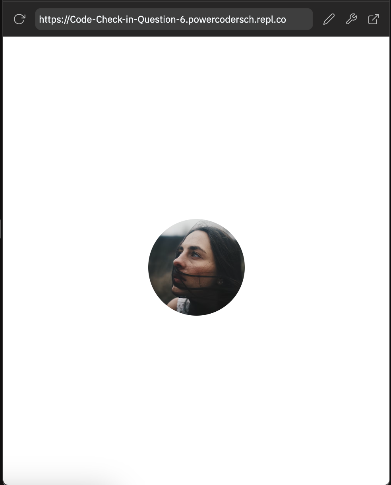

# Instructions  

Please read and complete the assignments. You don't have to do the assignments in the given order. 

  ## Assignments
  1. Complete these 3 quizzes and save a screenshot of each result in the folder `assignment_1`:
     *  [W3Schools HTML Quiz](https://www.w3schools.com/html/html_quiz.asp)
     *  [W3Schools CSS Quiz](https://www.w3schools.com/css/css_quiz.asp)
     *  [W3Schools JavaScript Quiz](https://www.w3schools.com/js/js_quiz.asp)
  -----
  2. Create a folder named `assignment_2` and make a simple HTML file with a rectangular image in the middle of it. Use a CSS file to round and center the image. The goal is to have an page that looks like the
following: 
  -----
  3. **Debug HTML & CSS:**

     Go to `assignment_3`, read and follow the instructions there.
  -----
  4. Describe **in words** a program called **PowerCoders**, which does the following:
     *  Prints the numbers from 1-100 except:
     *  For multiples of five, print “Power”
     *  For multiples of seven, print “Coders”
     *  For multiples of five and seven, print “PowerCoders”
    
    Describe in words how you would write such a program. Make sure to write out each step clearly. Imagine you have to explain to a non-coder what you want to do and why. This part of the exercise does not ask for any code.
  -----
#### Good luck! 🍀

 
  